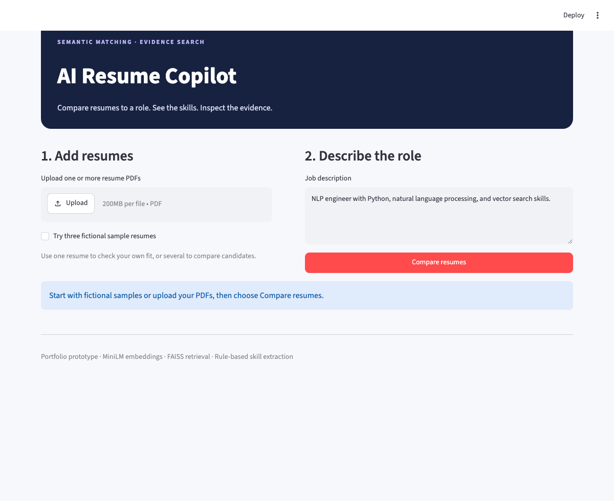

# AI Resume Copilot

**Match resumes to a role—and inspect the evidence.**

[](https://github.com/CodeByVish/resume-intelligence-engine/actions/workflows/ci.yml)


An explainable resume-matching prototype for recruiters comparing candidates and individuals checking their resume against a job description. Built with sentence-transformer embeddings, skill coverage, FAISS retrieval, and Streamlit.



*Actual local app capture with fictional resumes. Salty Pink palette with locally bundled Cormorant Garamond and Inter fonts. [Still screenshot](assets/demo.png) · [Reproduce the recording](examples/README_GIF.md)*

## Try it

Use Python 3.11 and run these commands from the project root:

```bash
git clone https://github.com/CodeByVish/resume-intelligence-engine.git
cd resume-intelligence-engine
python3.11 -m venv .venv
source .venv/bin/activate
python -m pip install -r requirements.txt
python -m streamlit run app.py
```

Select **Try three fictional sample resumes**, then **Compare resumes**. Or upload one or more text-based PDFs. Under **Evidence search**, try `semantic search pipelines`.

The pinned MiniLM model downloads on first use; no LLM API key is required. Inference runs locally. Scanned PDFs require OCR, which this prototype does not include.

For development, the CLI demo, and recording:

```bash
python -m pip install -r requirements-dev.txt
bash examples/demo.sh
python -m pytest -q
python -m src.evaluation.run
```

A clean macOS arm64 / Python 3.11 install was verified. [requirements-tested.txt](requirements-tested.txt) records the exact environment used for evaluation; the smaller requirements files define supported package ranges.

## What it does

- Extracts PDF text and structured sections: skills, experience, education, and projects.
- Ranks single or multiple resumes against a job description.
- Displays semantic similarity, skill coverage, matched skills, and missing mentions.
- Retrieves source excerpts with filenames using a FAISS index.
- Preserves rankings during evidence searches and clears stale results when inputs change.
- Shows an explicit keyword-only fallback warning if the embedding model fails.

The UI returns retrieved evidence, not generated answers. Legacy rule-based question and answer-template helpers remain in the source but are not used by the demo.

## How it works

```text
PDFs → PyMuPDF → text → structured profiles
                  ├→ MiniLM embeddings + job embedding → cosine similarity ┐
                  ├→ boundary-aware skill aliases → job-skill coverage     ├→ ranking
                  └→ overlapping text chunks → MiniLM → FAISS → excerpts
```

The app and CLI share the same scorer:

```text
keyword = recognized job skills found in resume / recognized job skills
hybrid  = 100 × (0.75 × cosine similarity + 0.25 × keyword)
```

Keyword coverage is zero when no job skills are recognized. Weights are fixed heuristics, not learned parameters. Scores are not hiring probabilities. Missing skills mean no recognized mention was found, and excerpts are supporting source text—not mathematical attributions of the embedding score.

## Evaluation: compare against baselines

12 fictional profiles × 6 job descriptions, with 72 author-labeled relevance judgments. Labels and weights were fixed before running. Higher nDCG@3 means more relevant profiles appear near the top.

| Method | Mean nDCG@3 |
| --- | ---: |
| Keyword coverage | 0.783 |
| Semantic similarity | **0.949** |
| 75/25 hybrid | 0.844 |

**Semantic-only performed best on this fixture.** The hybrid improved on keyword coverage but was more vulnerable to keyword stuffing than semantic-only ranking. For the NLP search role, a profile describing dense retrieval without dictionary keywords ranked third under semantic scoring and fifth under hybrid scoring.

The app retains the original hybrid formula so its behavior and weaknesses are inspectable. These results do not justify claiming the hybrid is the best method. This small synthetic sanity check is not a real-world hiring benchmark.

[Per-job results and failure cases](docs/evaluation.md) · [Full rankings, model revision, and fixture hash](docs/evaluation-results.json) · [Labeled fixture](data/evaluation/benchmark.json)

## Validation and limits

- 10 automated tests cover scoring, aliases, false substring matches, explicit model failures, PDF uploads, FAISS source attribution, ranking metrics, and Streamlit result persistence.
- GitHub Actions runs tests with model downloads disabled; unit tests use controlled embeddings.
- The browser capture script verifies real batch ranking, evidence retrieval, and a fresh single-resume upload. Desktop and mobile screenshots were inspected locally.
- Parsing is heuristic, the skill dictionary is small, and whole-resume embeddings may truncate long documents. Keyword mentions do not prove experience or competence.
- No model training, generative LLM, production deployment, or validated hiring outcomes are claimed.

## Interview and resume

> Built an explainable resume-matching application using MiniLM embeddings, hybrid skill scoring, and FAISS evidence retrieval; compared three ranking methods on 72 synthetic resume–job pairs and documented keyword-stuffing failure cases.

[Interview outline and project scope](docs/portfolio-plan.md)
